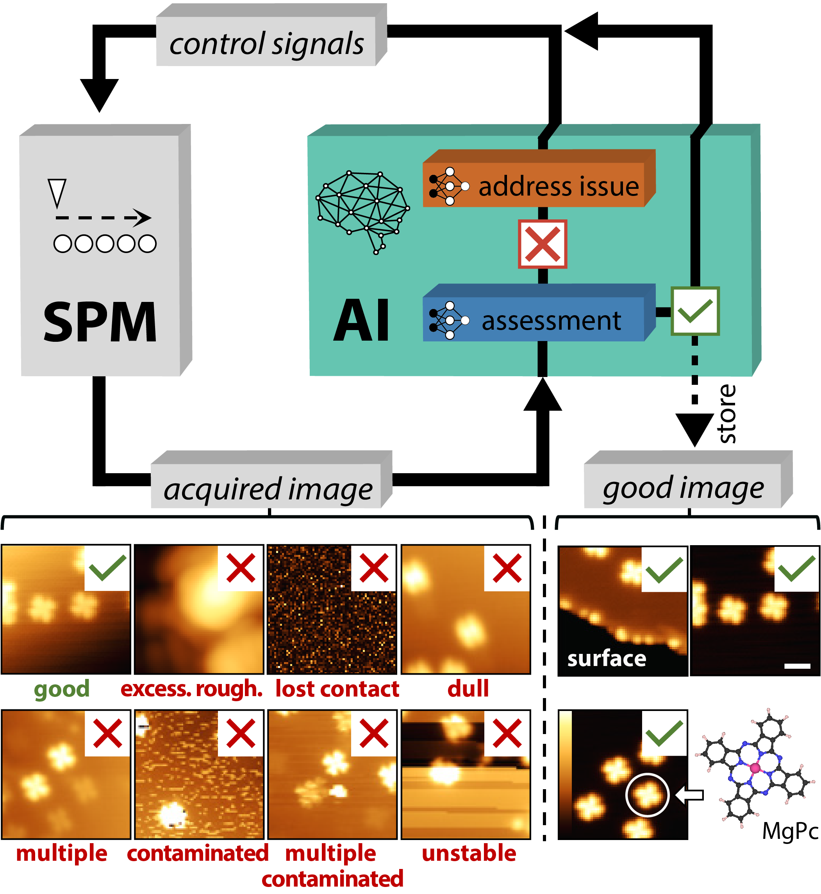
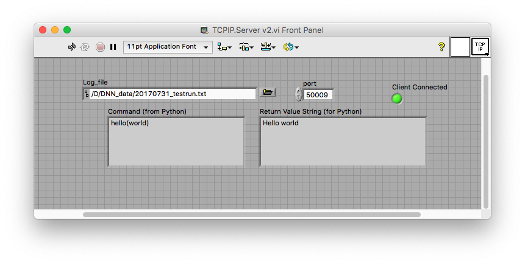
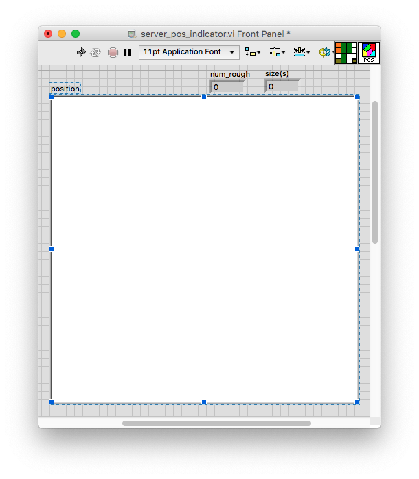

# DeepSPM - Artificial-intelligence-driven scanning probe microscopy
PDF: https://www.nature.com/articles/s42005-020-0317-3

Alexander Krull<sup>1,2</sup>, Peter Hirsch<sup>1</sup>, Carsten Rother, Agustin Schiffrin<sup>3,5</sup>, Cornelius Krull<sup>4,5</sup></br>
<sup>1</sup>Authors contributed equally, in no particular order</br>
<sup>2</sup>krull@mpi-cbg.de; <sup>3</sup>agustin.schiffrin@monash.edu; <sup>4</sup>ckrull@mailbox.org</br>
<sup>5</sup>These authors jointly supervised this work




## Abstract
Scanning probe microscopy (SPM) has revolutionized the fields of materials, nano-science, chemistry, and biology, by enabling mapping of surface properties and surface manipulation with atomic precision. However, these achievements require constant human supervision; fully automated SPM has not been accomplished yet. 
Here we demonstrate an artificial intelligence framework based on machine learning for autonomous SPM operation (DeepSPM). DeepSPM includes an algorithmic search of good sample regions, a convolutional neural network to assess the quality of acquired images, and a deep reinforcement learning agent to reliably condition the state of the probe. DeepSPM is able to acquire and classify data continuously in multi-day scanning tunneling microscopy experiments, managing the probe quality in response to varying experimental conditions. Our approach paves the way for advanced methods hardly feasible by human operation (e.g., large dataset acquisition and SPM-based nanolithography). DeepSPM can be generalized to most SPM techniques, with the source code publicly available.


## tldr:
Welcome to DeepSPM - a framework for automated Scanning Probe Microscopy (SPM).
DeepSPM can autonomously run most SPM setups performing a variety of tasks:

- select imaging regions
- detect and resolve problems like lost contact or probe crashed
- detect bad probe states
- condition the probe to resolve bad probe state
- detect and avoid bad sample regions

*This is research software, make sure you know what each setting does and adjust it to your setup. It is highly likely that your particular system is not covered in this proof of concept, and you have to implement additional functionality. If you do write additional code or modify ours please contribute by sending us a pull request.*

## Overview
An SPM system controlled by DeepSPM consists of two parts:

1. An [instrument control server](#instrument-control-server) running on the control PC of the SPM instrument.
2. The [DeepSPM](#deepspm) software running on the same or another PC communicating with the instrument server via TCP/IP (e.g. through a secure ssh tunnel).
This DeepSPM software itself consists of two parts:
    - A [classifier](#classifier) that is trained to analyze recorded images and determine whether or not the shape of the probe is sufficient.
    - The [agent](#agent), which controls the microscope by sending commands to the control server.
      It uses the classifier to identify insufficient probe morphologies.

# Instrument Control Server

The Instrument Control Server controls SPM through the Nanonis programming interface. The server is able to execute a series of commands that are selected by DeepSPM ad send to the server via TCP/IP. The details of these commands are specfic to each SPM setup and need to adjusted accordingly.  This can be done by changing the parameters of the commands if the setup is similar to the Low Temperature Scanning Tunneling Microscope used in the study. 

## Requirements
- Nanonis v5 (SPECS) controlled SPM setup. (It is possible to use other SPM systems that allows for scripting, this would however require the re-implementation of the instrument control server, see below)
- The instrument control server needs to  run on the instrument control PC.
- The nanonis_programming_interface_v5-5.7.861.78 or newer needs to be installed and configured (see the Nanonis instructions on how to do this).
- LabView (2014 or higher) needs to be installed.
- To send status/warning emails a python 3 install is required (e.g. miniconda) 


## Installation - LabView
``` shell
git clone https://github.com/abred/DeepSPM.git
```

The instrument control server consists of several Labview Virtual Intruments (VIs),
which can be run using the local LabView installation. These VI are downloaded when you clone the repo. 
It is important to keep the directory structure so that the server can find the individual command VIs.

The basic settings for operation need to be set in the the [deepSPM_server.ini](<./labview/Nanonis Server/deepSPM_server.ini>) file.
Make sure to go through those settings carefully as the **defaults will not work**.

## Usage
Start the main `TCPIP.Server v2` using the local labview install.
It needs to be configured and running. 
Note that an *existing* log(txt) file has to be set.
Additionally the port for communication has to be set (the same as set for the DeepSPM [agent](#agent)).



During operation, the server position indicator will show where images were recorded relative to the approach position of the probe.



The server is now ready to communicate with the DeepSPM [agent](#agent).

# DeepSPM

## Requirements
- A python environment with access to a GPU (the required memory size depends on your network parameters, we recommend 11GB, but it will work with less).
- DeepSPM is implemented in Python3 and requires Tensorflow-1.

## Installation
We recommend using a virtual environment (e.g. conda)

``` shell
git clone https://github.com/abred/DeepSPM.git
conda create -n deepspm
conda activate deepspm
pip install pypng
cd DeepSPM
conda install --file requirements.txt
```

## DeepSPM Code Overview
The code consists of three parts:
`agent` contains the reinforcement learning agent used to control the SPM,
`classifier` the code to train a CNN to differentiate good from bad images and
`pytil` auxiliary code.
(we trained our models on a slurm based cluster, if this is not the case for you,
you can just ignore the lines starting with #SBATCH)</br>
Use the respective `prepareAndRun.sh` scripts to start training.
The program will be executed in a local `tempFiles` subdirectory, which can be deleted after execution.
All outputs and code will be written to `$HOME/STM/experiments` (this can be changed using the `--root` parameter).

### Classifier
You can get the data we used to train the classifier here:
https://alex-krull.github.io/stm-data.html</br>
To use DeepSPM with your experimental setup you will have to curate a similar dataset of corresponding images. 

#### Start Training
Adapt the paths in the run scripts to point to the right location of the data on your system.
You have to adapt the `-i` parameter in the [run.sh](./classifier/run.sh) to point to your training data (and optionally `valInDir[1-4]` to up to four different validation datasets).
Please see [parseNNArgs.py](./pyutil/parseNNArgs.py) for a description of all parameters.
After configuring your `run.sh`:
``` shell
cd classifier
./prepareAndRun.sh 1
```
(the `1` starts it locally, without using slurm)

#### Resume Training (e.g. more iterations)
``` shell
cd path/to/output
./resume.sh 1
```

#### Evaluation
``` shell
./runEval.sh path/to/checkpoint
```

[runEval.sh](./classifier/runEval.sh) expects the path to the checkpoint to be used for evaluation as a command line argument.
Additionally, you have to set the path to the validation data (`--validationData` or `--loadValBlob`) in the file itself.

### Agent
Before starting the agent, you have to first train a classifier (see above).

Subsequently you may have to set several parameters in the [agent/run.sh](./agent/run.sh). Besides optionally modifying some defaults, you have to at least set the --classNN parameter to point to the output folder of this classifier or to a specific model.ckpt-xxx file within that folder.
Please see [parseNNArgs.py](./pyutil/parseNNArgs.py) for a description of all parameters.

We recommend that you first
1. start the agent with the `--startServer` option activated, which will locally start a dummy server
replacing the control server.
If you use this option you also have to provide the path to some images using the `--dummyImageDir`. The dummy server will randomly return them when asked to perform a scan. 
We recommend to use the data form https://alex-krull.github.io/stm-data.html</br> and point it to `path/to/dataset/Train/**/*Ransac.npy`.

2. use the control server with a Nanonis simulated SPM environment. 
To do this, remove the `--startServer` option and set `--host` and `--port` so that the control server can be reached.

#### The Action File
The [action file](./agent/actions.csv) describes the possible probe conditioning actions that can be executed.
You might have to edit this file once you are working with your real SPM setup.
Every row corresponds to one action.
The columns are:
1. `"[dip],[bias (voltage)],[timing]"` describes the conditioning action. This is the string sent to the server.
If `"stall"` nothing is sent to the server.
2. `[Forbidden Area (nm)]` diameter of the area that is blocked after the action is executed.
3. `[required Area (nm)]` the hight/width of a square patch of free area in the last scan that is required for the action to be executed.
4. `[use for reset]` can be `0` or `1`. 
When in [training mode](training-mode-and-operational-mode), actions marked with `1` are randomly selected to reset the probe.
5. `[for measurement]` this can only be 1 for one of the actions and must be 0 for all others.
When in [operational mode](training-mode-and-operational-mode),
this action is executed whenever the probe is thought to be in order and measurements are collected.
The main purpose is that the `[Forbidden Area (nm)]` describes how much area is to be blocked when a measurement is made.
Note that in the example `actions.csv` we set  `[required Area (nm)]` of the action to a large value, 
so that it can never be selected except for making measurements.

#### Starting an Agent
After configuring your `run.sh` and potentially editing the action file:
``` shell
cd agent
./prepareAndRun.sh 1 [optional:path/to/approachareamask]
```
(if the approach area is partially used (e.g. by another agent run),
supply the path to the `mask.npy` written by the previous run)

#### Interrupting a Running Agent
To interrupt a running agent,
open a second terminal,
navigate to its output directory, and create a file named `stop`.

``` shell
touch stop
```
When the agent detects this file it will finish the current step and then shut down gracefully.
Note, when operating with dummy server, the agent will shut down but the server will not.
You have to stop it using `ctrl + c` after the agent is finished.

#### Resuming an Agent
To resume an agent that has been previously interrupted,
navigate to its output directory and run:
``` shell
./resume.sh 1 [optional:path/to/approachareamask]
```
(if the agent is restarted and the approach area is partially used,
supply the path to the mask written by the previous run, by default using just `./mask.npy` should work).

#### Training Mode and Operational Mode
The agent has to be trained in order to perform well on probe conditioning.
by removing the `--maxBadImgCount` parameter from the `run.sh` you can run the agent in **training mode**.
This means that whenever a a good probe state is achieved, the probe will be purposely reset 
(destroyed via strong conditioning actions) and a new conditioning episode is started.
This is done to allow the agent to quickly gain experience in restoring the probe.
We recommend to run the agent for an extended period like this.

At some point you might decide to [stop](#interrupting-a-running-agent) the agent and [resume](#resuming-an-agent) it in **operational mode**.
To do so, we navigate to the agents output folder and edit the local copy of `run.sh`, setting e.g. `--maxBadImgCount 10`. 
We can now resume the agent.
While learning continues also in operational mode, 
the agent will now no longer reset the probe once a good probe quality is achieved.
Instead, it will attempt to collect data until the probe quality deteriorates.
By setting `--maxBadImgCount 10`, we tell it to initiate a probe conditioning episode only 
after 10 consecutive images have been classified as 'bad probe'.

#### Different Outputs
The agent writes a variety of different log files and images.

##### Images
The following images are written to the `imgs` directory:
- The `...-emptySpots.png` images show the empty areas in the scanning region as white.
- The `...-marked.png` images larges empty square area im the scanning region and the position where the action would be performed marked with an 'x'.

The following images are additionally written to the `imgs` directory when the `--veryveryverbose` option has been selected:
- The `...-scan-raw.npy` and `...-scan-raw.png` files contain the recorded images.
- The `...-scan-processeed.npy` and `...-scan-processeed.png` files contain the recorded images after applying RANSAC plane subtraction and normalization.
- The `...-mask.png` show the approach area. regions that have been visited or blocked are shown in white.

When in [operational mode](training-mode-and-operational-mode), data that is potentially valid is stored in the `imgsCollect` directory:
- The `...-scan-raw.npy` files contain the recorded images.
- The `...-scan-processeed.npy` files contain the recorded images after applying RANSAC plane subtraction and normalization.
The file names contain `good` or `bad` depending on how the quality of the probe has been classified by the classifier network.

The file names of all files contain the following identifiers:
- `Img_` is a counter of the number of images that have so far been stored as potentially valid data in the `imgsCollect` directory.
This corresponds to column 4 in the `dataCollLog.txt` file.
- `-Step_` is a counter for the number of performed conditioning steps.
- `-Ep_` is a counter for the number of performed conditioning episodes.
- `-InEpStep_` is a counter for the number of performed conditioning steps in the conditioning episode.

##### clientLog.txt
This file logs all communication between client and server.
The columns correspond to:
1. Date and time using [datetime.now()](https://docs.python.org/3/library/datetime.html).
2. Time in seconds since the epoch ([Unix time](https://en.wikipedia.org/wiki/Unix_time)).
3. The contents of the communication. Outgoing requests to the server are marked with `>>`. Incoming responses are marked with `<<`.

##### actionLog.txt
This file logs all executed probe conditioning actions and their results.
The columns correspond to:
1. [Unix time](https://en.wikipedia.org/wiki/Unix_time)
2. A global counter for the number of executed actions.
3. A counter for the number of executed probe conditioning episodes.
4. A relative counter of the executed actions within the current episode
5. The index of the executed action.
6. Is this an evaluation episode?
7. Is the image recorded after the action classified as 'good probe' by the classifier network?
8. The probability of having a good probe according to the classifier network?
9. The received reward
10. The current value of the epsilon greedy scheme
11. The method used to select the action. When the '--interEval' option is set a random baseline is used in alternation with the agent.

##### episodeLog.txt
This file has one entry for each probe shaping episode.
The columns are:
1. [Unix time](https://en.wikipedia.org/wiki/Unix_time)
2. Episode counter
3. Cumulative reward of the episode
4. The discounted reward of the episode
5. Length of the episode
6. The current value of the epsilon greedy scheme
7. The method used to select the actions. When the '--interEval' option is set a random baseline is used in alternation with the agent.

##### qValExpl.txt and qValEval.txt
These log files contain the predicted q values of all actions.
Depending on whether the current episode is a normal exploration episode or a pure evaluation episode the data are written to qValExpl.txt and qValEval.txt, respectively.
1. [Unix time](https://en.wikipedia.org/wiki/Unix_time)
2. A global counter for the number of executed actions.
3. Episode counter
4. A relative counter of the executed actions within the current episode
5. A list of the predict Q-values for all actions
6. A list encoding which actions are currently possible. Possible actions have a value of 0, actions that cannot be executed due to lack of space have the value '-inf'.

##### mainLoopTime.txt and learnLoopTime.txt
These two log files contain information about the time required for one loop of the agent exploration thread and the learning thread respectively.
The columns are:
1. [Unix time](https://en.wikipedia.org/wiki/Unix_time)
2. Required time for one iteration in seconds

##### dataCollLog.txt
This logfile contains various information regarding the data collection.
The columns are:
1. Date and time using [datetime.now()](https://docs.python.org/3/library/datetime.html).
2. Time in seconds since the epoch ([Unix time](https://en.wikipedia.org/wiki/Unix_time)).
3. A tag describing what DeepSPM is currently doing.
4. If applicable, contains the index of potentially valid images stored in the `imgsCollect` directory.
5. If applicable, contains the number of consecutive images classified as 'bad probe'
6. The probability (predicted by the classifier) that the probe is good.
7. X-coordinate of the last performed scan location
8. Y-coordinate of the last performed scan location

# Testing
The Nanonis software offers a simulated SPM enviroment which is ideal for testing the instrument control server,  the agent, and the communication.

# Cite
```
@Article{Krull2020,
author={Krull, Alexander
and Hirsch, Peter
and Rother, Carsten
and Schiffrin, Agustin
and Krull, Cornelius},
title={Artificial-intelligence-driven scanning probe microscopy},
journal={Communications Physics},
year={2020},
volume={3},
number={1},
pages={54},
abstract={Scanning probe microscopy (SPM) has revolutionized the fields of materials, nano-science, chemistry, and biology, by enabling mapping of surface properties and surface manipulation with atomic precision. However, these achievements require constant human supervision; fully automated SPM has not been accomplished yet. Here we demonstrate an artificial intelligence framework based on machine learning for autonomous SPM operation (DeepSPM). DeepSPM includes an algorithmic search of good sample regions, a convolutional neural network to assess the quality of acquired images, and a deep reinforcement learning agent to reliably condition the state of the probe. DeepSPM is able to acquire and classify data continuously in multi-day scanning tunneling microscopy experiments, managing the probe quality in response to varying experimental conditions. Our approach paves the way for advanced methods hardly feasible by human operation (e.g., large dataset acquisition and SPM-based nanolithography). DeepSPM can be generalized to most SPM techniques, with the source code publicly available.},
issn={2399-3650},
doi={10.1038/s42005-020-0317-3},
url={https://doi.org/10.1038/s42005-020-0317-3}
}
```
